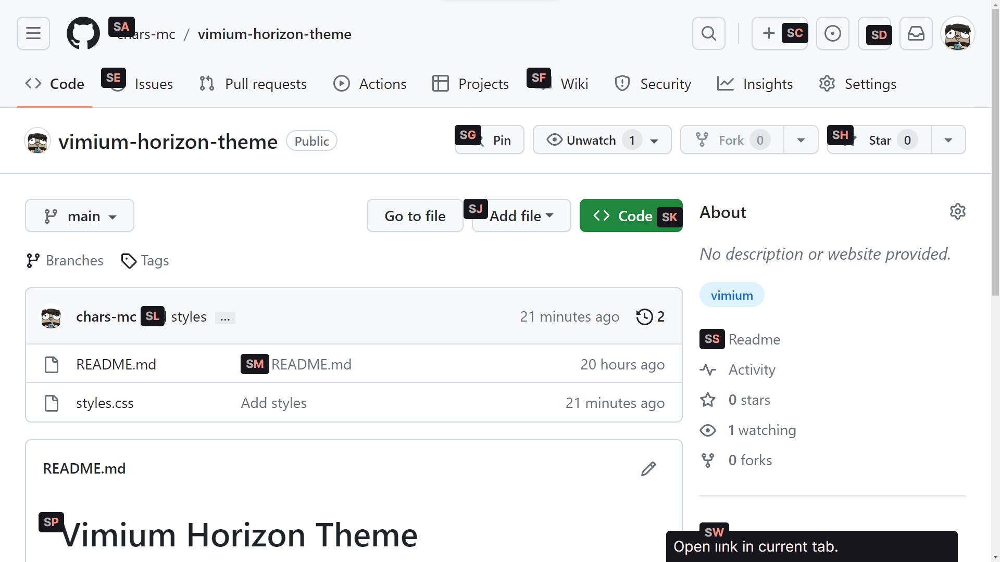
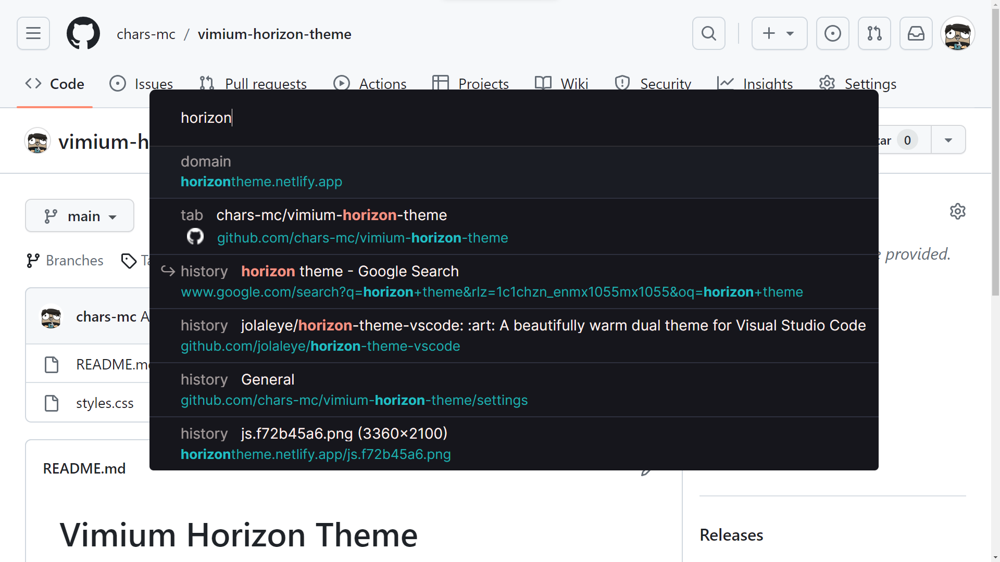
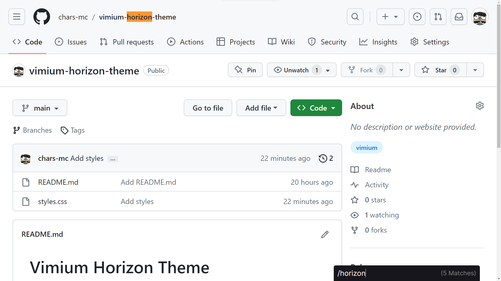
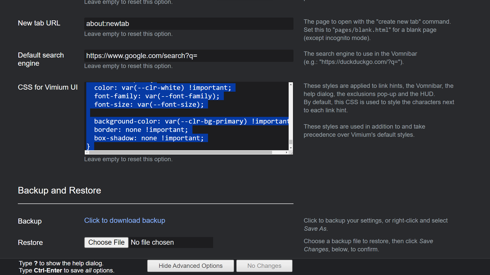

# Vimium Horizon Theme

A theme for [Vimium](https://github.com/philc/vimium) based on [Horizon Theme](https://horizontheme.netlify.app/).

## Screenshots

### Hints

### Vomnibar

### Find

## Instructions

Copy the content of the file [`styles.css`](styles.css) and paste it into `Vimium Options > CSS for Vimium UI`.

